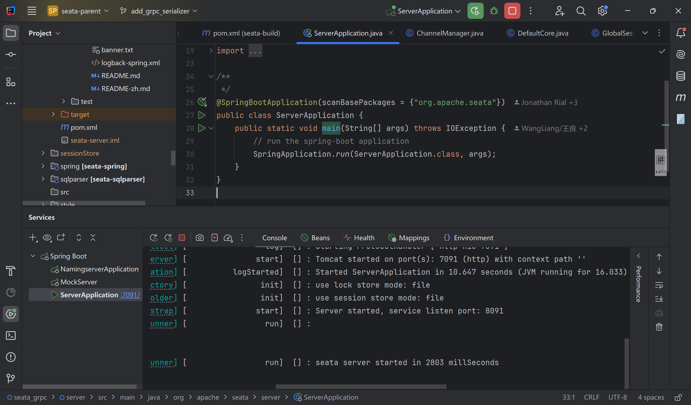
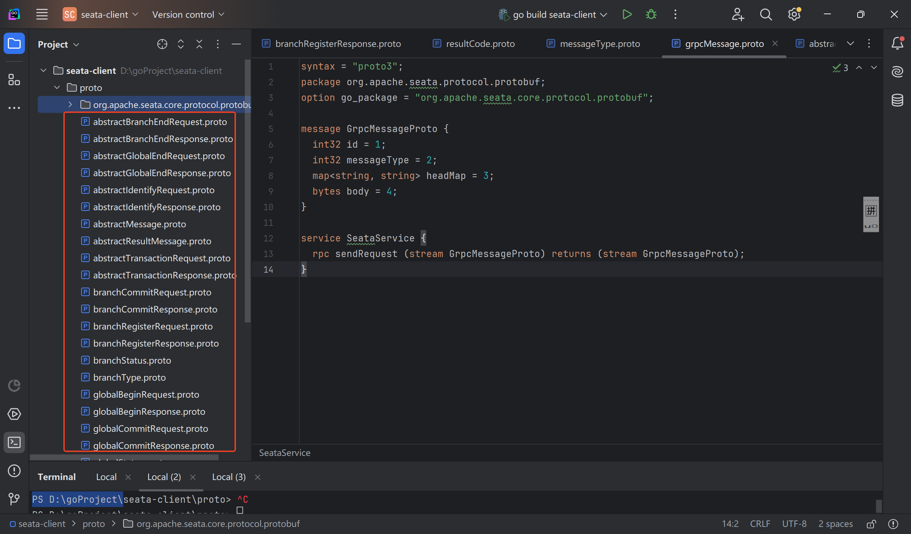
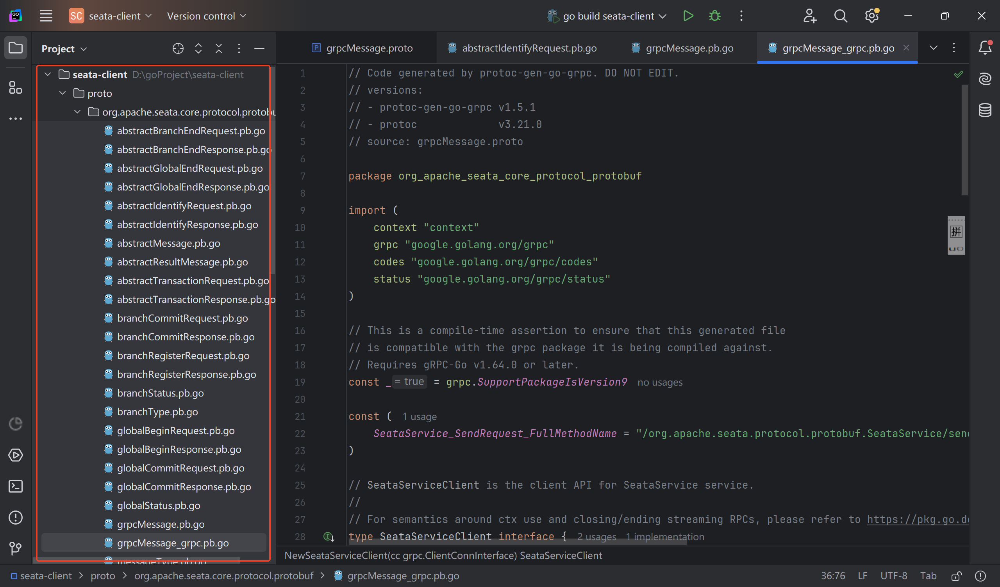
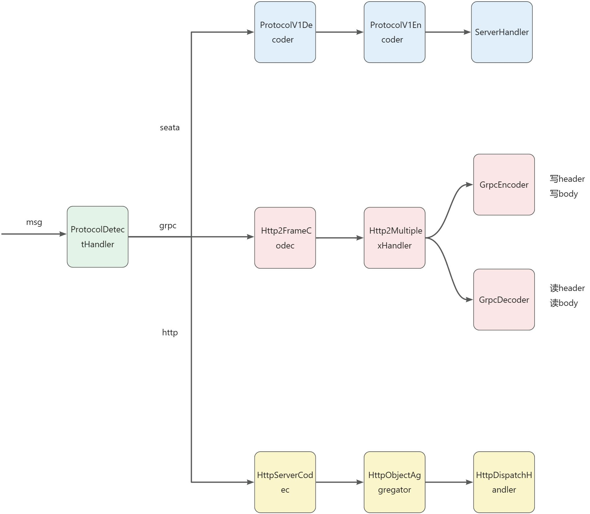

# 背景
随着PR [https://github.com/apache/incubator-seata/pull/6754](https://github.com/apache/incubator-seata/pull/6754) 的合并，Seata Server能够做到识别并处理Grpc请求，这意味着任意语言客户端，只需要引入proto文件，就可以和部署在JVM上的Seata Server通信，进而实现分布式事务的全流程。

下面以Go语言为例，向大家演示这一过程。

# 环境准备
Goland 2024.2

Idea 2024.3

jdk 1.8

go 1.23.3

Seata 2.3.0-SNAPSHOT

libprotoc 3.21.0

# 操作过程
## 部署并启动 Seata Server
运行 org.apache.seata.server.ServerApplication#main，如下所示



## proto文件导入
在go项目中导入完成本次事务流程所需的proto文件，包括各类事务请求和响应的proto文件和发起RPC的proto文件。如下所示



## grpc相关文件生成
在上一步导入的proto文件目录下，执行命令

```shell
 protoc --go_out=. --go-grpc_out=. .\*.proto
```

执行完后会生成grpc代码，如下所示



## grpc调用
在main.go中完成一次分布式事务的流程，并打印Seata Server的响应，代码如下所示

```go
func main() {
    conn, err := grpc.Dial(":8091", grpc.WithInsecure())
    if err != nil {
        log.Fatalf("did not connect: %v", err)
    }
    defer conn.Close()
    client := pb.NewSeataServiceClient(conn)
    stream, err := client.SendRequest(context.Background())
    if err != nil {
        log.Fatalf("could not sendRequest: %v", err)
    }
    defer stream.CloseSend()

    sendRegisterTm(stream)
    xid := sendGlobalBegin(stream)
    sendBranchRegister(stream, xid)
    sendGlobalCommit(stream, xid)
}

func sendRegisterTm(stream grpc.BidiStreamingClient[pb.GrpcMessageProto, pb.GrpcMessageProto]) {
	abstractIdentifyRequestProto := &pb.AbstractIdentifyRequestProto{
		ApplicationId: "test-applicationId",
	}
	registerTMRequestProto := &pb.RegisterTMRequestProto{
		AbstractIdentifyRequest: abstractIdentifyRequestProto,
	}

	registerTMResponseProto := &pb.RegisterTMResponseProto{}
	sendMessage(stream, registerTMRequestProto, registerTMResponseProto)
}

func sendGlobalBegin(stream grpc.BidiStreamingClient[pb.GrpcMessageProto, pb.GrpcMessageProto]) string {
	globalBeginRequestProto := &pb.GlobalBeginRequestProto{
		TransactionName: "test-transactionName",
		Timeout:         200,
	}
	globalBeginResponseProto := &pb.GlobalBeginResponseProto{}
	sendMessage(stream, globalBeginRequestProto, globalBeginResponseProto)
	return globalBeginResponseProto.Xid
}

func sendBranchRegister(stream grpc.BidiStreamingClient[pb.GrpcMessageProto, pb.GrpcMessageProto], xid string) {
	branchRegisterRequestProto := &pb.BranchRegisterRequestProto{
		Xid:             xid,
		LockKey:         "1",
		ResourceId:      "test-resourceId",
		BranchType:      pb.BranchTypeProto_AT,
		ApplicationData: "{\"mock\":\"mock\"}",
	}

	branchRegisterResponseProto := &pb.BranchRegisterResponseProto{}
	sendMessage(stream, branchRegisterRequestProto, branchRegisterResponseProto)
}

func sendGlobalCommit(stream grpc.BidiStreamingClient[pb.GrpcMessageProto, pb.GrpcMessageProto], xid string) {
	abstractGlobalEndRequestProto := &pb.AbstractGlobalEndRequestProto{
		Xid: xid,
	}
	globalCommitRequestProto := &pb.GlobalCommitRequestProto{
		AbstractGlobalEndRequest: abstractGlobalEndRequestProto,
	}

	globalCommitResponseProto := &pb.GlobalCommitResponseProto{}
	sendMessage(stream, globalCommitRequestProto, globalCommitResponseProto)
}

func sendMessage(stream grpc.BidiStreamingClient[pb.GrpcMessageProto, pb.GrpcMessageProto], req proto.Message, response proto.Message) {
	anyMsg, err := anypb.New(req)
	if err != nil {
		log.Fatalf("could not new any msg: %v", err)
	}
	marshal, err := proto.Marshal(anyMsg)
	msg := &pb.GrpcMessageProto{
		HeadMap: map[string]string{},
		Body:    marshal,
	}
	err = stream.Send(msg)
	if err != nil {
		log.Fatalf("could not send msg: %v", err)
	}
	resp, err := stream.Recv()
	if err != nil {
		log.Fatalf("failed to receive message: %v", err)
	}

	body := resp.Body
	var anyMessage anypb.Any
	err = proto.Unmarshal(body, &anyMessage)
	if err != nil {
		log.Fatalf("failed to unmarshal to any: %v", err)
	}
	err = anypb.UnmarshalTo(&anyMessage, response, proto.UnmarshalOptions{})
	if err != nil {
		log.Fatalf("failed to unmarshal to message: %v", err)
	}

	log.Printf("Received: %+v", response)
}
```

运行后，Seata Server控制台打印如下


Go客户端控制台打印如下


# 实现原理
## proto设计
为了实现与多语言grpc客户端的通信，Seata Server定义了grpcMessage.proto，其中定义了装配 Seata各种Message对象的GrpcMessageProto和装配Seata各类通信请求的双向流接口sendRequest。Seata Server以grpcMessage.proto作为媒介，可以实现与多语言客户端的通信

```proto
syntax = "proto3";
package org.apache.seata.protocol.protobuf;
import "google/protobuf/any.proto";
option java_multiple_files = true;
option java_outer_classname = "GrpcMessage";
option java_package = "org.apache.seata.core.protocol.generated";

message GrpcMessageProto {
    int32 id = 1;
    int32 messageType = 2;
    map<string, string> headMap = 3;
    google.protobuf.Any body = 4;
}

service SeataService {
    rpc sendRequest (stream GrpcMessageProto) returns (stream GrpcMessageProto);
}
```

除此之外，还定义了GrpcSerializer，适配 Seata 的序列化器SPI体系，用于实现protobuf字节流和Seata消息对象的互相转换

## grpc协议识别
Seata Server实现了ProtocolDetectHandler和ProtocolDetector。ProtocolDetectHandler作为ByteToMessageDecoder，在收到消息时，会遍历ProtocolDetector列表寻找能够识别当前消息的ProtocolDetector，ProtocolDetector通过识别魔数的方式区分Seata协议，Http1.1协议，Http2协议，一旦识别成功，会将能够处理该协议的ChannelHandler加入到当前Channel的Pipeline中



## grpc请求发送与处理
Seata Server 实现了GrpcEncoder和GrpcDecoder，GrpcEncoder负责将Seata的RpcMessage转换为grpc原生客户端可识别的GrpcMessageProto，并在header中填充status，contentType等协议头用于与grpc原生客户端通信。GrpcEncoder还负责适配grpc协议规范，将压缩位、长度、消息体按照grpc协议约定的顺序写入channel

GrpcDecoder负责处理grpc原生客户端的请求。由于grpc客户端在底层传输时通过队列的方式实现了请求的分批flush，因此GrpcDecoder还负责将一批请求进行拆包。最终GrpcDecoder将protobuf字节流转换为一个或多个RpcMessage，并传递给Seata请求处理器

## grpc连接的建立和管理
Server端只需配置配置一个ProtocolDetectHandler，即可完成各种类型连接的识别和建立

```java
@Override
public void initChannel(SocketChannel ch) {
    ProtocolDetector[] defaultProtocolDetectors = {
            new Http2Detector(getChannelHandlers()),
            new SeataDetector(getChannelHandlers()),
            new HttpDetector()
    };
    ch.pipeline().addLast(new IdleStateHandler(nettyServerConfig.getChannelMaxReadIdleSeconds(), 0, 0))
            .addLast(new ProtocolDetectHandler(defaultProtocolDetectors));
}
```

Client端在每次获取Channel时，如果当前配置的通信方式是Grpc，则会以NioSocketChannel作为父Channel，获取一个Http2MultiStreamChannel，并在该Channel中添加grpc相关的handler

```java
if (nettyClientConfig.getProtocol().equals(Protocol.GPRC.value)) {
    Http2StreamChannelBootstrap bootstrap = new Http2StreamChannelBootstrap(channel);
    bootstrap.handler(new ChannelInboundHandlerAdapter() {
        @Override
        public void handlerAdded(ChannelHandlerContext ctx) throws Exception {
            Channel channel = ctx.channel();
            channel.pipeline().addLast(new GrpcDecoder());
            channel.pipeline().addLast(new GrpcEncoder());
            if (channelHandlers != null) {
                addChannelPipelineLast(channel, channelHandlers);
            }
        }
    });
    channel = bootstrap.open().get();
}
```

